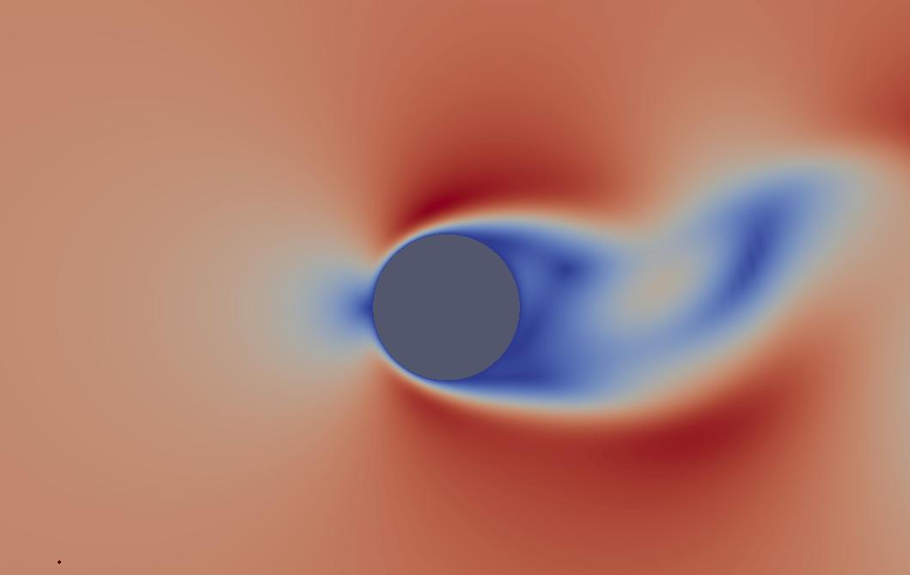
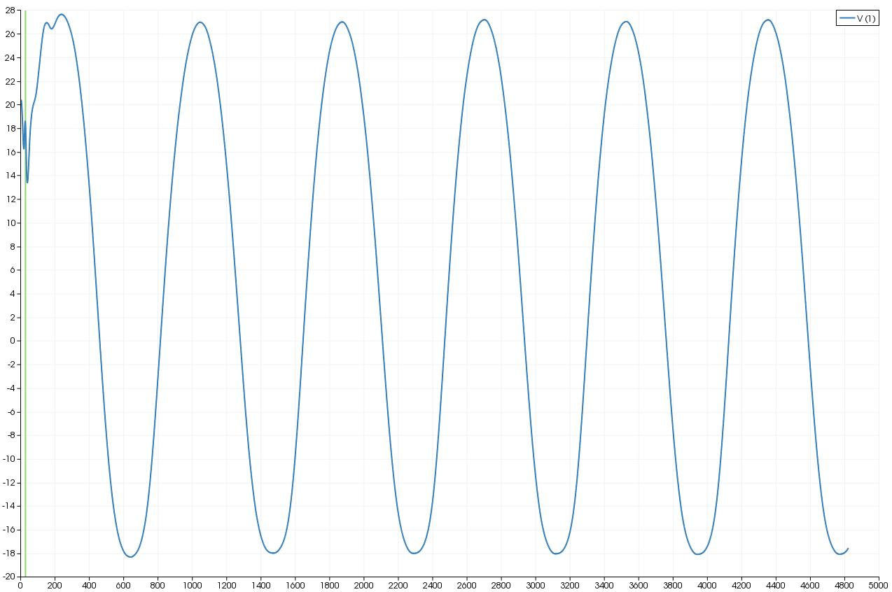

2D Laminar Cylinder
-------------------

Overview
^^^^^^^^
The periodic shedding over a cylinder at :math:`Re=150` can be used to verify the time accuracy of the solver. 

Conditions
^^^^^^^^^^

:math:`Re=150`

:math:`Mach=0.1`

Results
^^^^^^^

	Laminar flow over a 2D cylinder

	Time history of pressure at monitor point

The Strouhal number is a dimensionless frequency given by

:math:`S_t=\frac{fD}{U}`

where :math:`D` is the diameter, :math:`U` is the freestream velocity and  :math:`f` is the shedding frequency.

For this case the shedding frequency is measured by monitoring the variation in pressure downstream of the cylinder and away from the centre of the wake so that it is not affected by the vortex shed by the opposite side.

:math:`D=1.0 m`

:math:`U=66.8163 m/s`

:math:`Timestep \: \Delta t = 0.0001s`

:math:`Distance between peaks \approx 827 timesteps`

:math:`Frequency = 1.0/(827*0.0001) = 12Hz`

:math:`S_t = \frac{fD}{U} = 12*1/66.813 = 0.18`

The experimental value of the Strouhal number ranges from :math:`0.179 - 0.182`.
