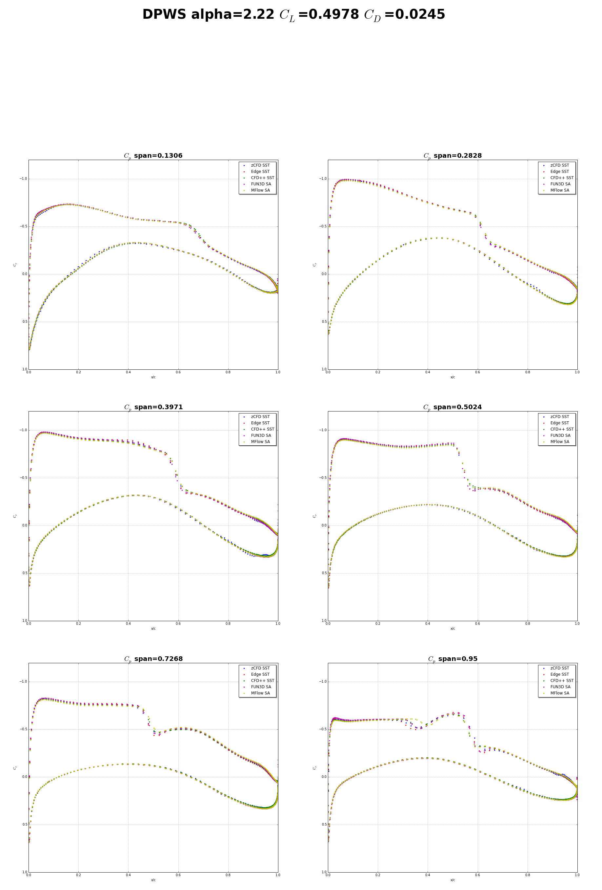

Overview
^^^^^^^^

.. figure:: http://aaac.larc.nasa.gov/tsab/cfdlarc/aiaa-dpw/Workshop5/DPW5_CRM_WindTunnelModel.png
	:width: 90%
	:align: center
	:alt: alternate text
	:figclass: align-center

Conditions
^^^^^^^^^^

:math:`C_L=0.5` 

Mesh
^^^^

Results
^^^^^^^
The results are compared to experiment and to CFL3D at three angles of attack.

	Drag Prediction Workshop 5 result comparisons

References
^^^^^^^^^^

`<http://aaac.larc.nasa.gov/tsab/cfdlarc/aiaa-dpw/>`_

